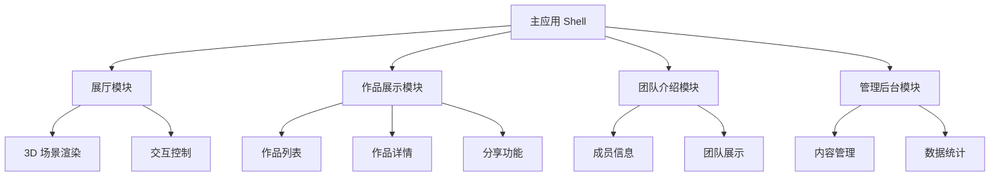

# iDesign 2025 全面优化规划方案

## 1. 项目现状分析

### 1.1 技术栈现状
- **前端框架**: Vue 3 + Composition API
- **3D 引擎**: Three.js + WebGL
- **构建工具**: Vite
- **状态管理**: 组合式 API + 已规划 Pinia 架构
- **国际化**: Vue I18n
- **样式**: CSS3 + 响应式设计

### 1.2 已有优化成果
- ✅ Canvas 分享卡片优化（对象池、缓存机制）
- ✅ 模型加载缓存机制
- ✅ 组合式 API 重构
- ✅ 错误处理统一化
- ✅ Pinia 状态管理架构设计

### 1.3 待优化痛点
- 🔴 缺乏微服务架构，单体应用扩展性受限
- 🔴 Three.js 渲染性能未充分优化
- 🔴 缺乏完整的监控和分析系统
- 🔴 开发工具链和 CI/CD 流程不完善
- 🔴 安全性和可访问性支持不足

## 2. 架构层面优化

### 2.1 微前端架构设计

#### 2.1.1 模块拆分策略


#### 2.1.2 技术实现方案
- **主框架**: qiankun 或 Module Federation
- **路由管理**: 统一路由分发
- **状态共享**: 全局事件总线 + Pinia 跨应用状态
- **样式隔离**: CSS Modules + Shadow DOM

### 2.2 插件化系统设计

#### 2.2.1 插件架构
```javascript
// 插件系统核心
class PluginSystem {
  constructor() {
    this.plugins = new Map();
    this.hooks = new Map();
  }
  
  // 注册插件
  register(plugin) {
    this.plugins.set(plugin.name, plugin);
    plugin.install(this);
  }
  
  // 执行钩子
  async executeHook(hookName, ...args) {
    const handlers = this.hooks.get(hookName) || [];
    for (const handler of handlers) {
      await handler(...args);
    }
  }
}
```

#### 2.2.2 可插拔模块
- **渲染引擎插件**: Three.js、Babylon.js 可切换
- **数据源插件**: 本地数据、API、CMS 对接
- **分析插件**: Google Analytics、百度统计等
- **主题插件**: 多套视觉主题切换

### 2.3 模块化重构方案

#### 2.3.1 核心模块拆分
```
src/
├── core/                 # 核心模块
│   ├── app/             # 应用核心
│   ├── router/          # 路由管理
│   └── store/           # 状态管理
├── modules/             # 业务模块
│   ├── exhibition/      # 展览模块
│   ├── works/           # 作品模块
│   ├── team/            # 团队模块
│   └── admin/           # 管理模块
├── shared/              # 共享模块
│   ├── components/      # 通用组件
│   ├── utils/           # 工具函数
│   └── services/        # 服务层
└── plugins/             # 插件模块
```

## 3. 性能优化全面方案

### 3.1 Three.js 渲染性能优化

#### 3.1.1 渲染管线优化
```javascript
class OptimizedRenderer {
  constructor() {
    this.renderer = new THREE.WebGLRenderer({
      antialias: false,           // 关闭抗锯齿，使用 FXAA
      powerPreference: "high-performance",
      stencil: false,
      depth: true
    });
    
    // 启用实例化渲染
    this.instancedMeshes = new Map();
    
    // 视锥体剔除优化
    this.frustumCuller = new FrustumCuller();
    
    // LOD 管理器
    this.lodManager = new LODManager();
  }
  
  render(scene, camera) {
    // 视锥体剔除
    const visibleObjects = this.frustumCuller.cull(scene, camera);
    
    // LOD 选择
    this.lodManager.updateLOD(visibleObjects, camera);
    
    // 批量渲染
    this.batchRender(visibleObjects);
  }
}
```

#### 3.1.2 几何体和材质优化
- **几何体合并**: 静态物体合并减少 Draw Call
- **纹理图集**: 多个小纹理合并为图集
- **材质实例化**: 相同材质共享实例
- **压缩纹理**: 使用 KTX2/DDS 格式

#### 3.1.3 动态 LOD 系统
```javascript
class LODManager {
  constructor() {
    this.lodLevels = [
      { distance: 50, quality: 'high' },
      { distance: 100, quality: 'medium' },
      { distance: 200, quality: 'low' }
    ];
  }
  
  updateLOD(objects, camera) {
    objects.forEach(obj => {
      const distance = camera.position.distanceTo(obj.position);
      const lodLevel = this.getLODLevel(distance);
      this.applyLOD(obj, lodLevel);
    });
  }
}
```

### 3.2 资源加载优化

#### 3.2.1 智能预加载系统
```javascript
class SmartPreloader {
  constructor() {
    this.loadQueue = new PriorityQueue();
    this.cache = new Map();
    this.loadingTasks = new Set();
  }
  
  // 基于用户行为预测加载
  predictiveLoad(userBehavior) {
    const predictions = this.analyzeUserPath(userBehavior);
    predictions.forEach(resource => {
      this.loadQueue.enqueue(resource, resource.priority);
    });
  }
  
  // 渐进式加载
  async progressiveLoad(resource) {
    // 先加载低质量版本
    const lowQuality = await this.loadLowQuality(resource);
    this.cache.set(resource.id + '_low', lowQuality);
    
    // 后台加载高质量版本
    this.loadHighQuality(resource).then(highQuality => {
      this.cache.set(resource.id, highQuality);
      this.emit('upgrade', resource.id);
    });
  }
}
```

#### 3.2.2 CDN 和缓存策略
- **多级 CDN**: 全球节点分发
- **智能缓存**: 基于访问频率的缓存策略
- **版本控制**: 资源版本化管理
- **压缩优化**: Gzip/Brotli 压缩

### 3.3 内存管理优化

#### 3.3.1 内存池管理
```javascript
class MemoryPool {
  constructor() {
    this.pools = {
      geometry: new ObjectPool(() => new THREE.BufferGeometry()),
      material: new ObjectPool(() => new THREE.MeshBasicMaterial()),
      texture: new ObjectPool(() => new THREE.Texture())
    };
    
    this.memoryMonitor = new MemoryMonitor();
  }
  
  acquire(type) {
    return this.pools[type].acquire();
  }
  
  release(type, object) {
    this.cleanup(object);
    this.pools[type].release(object);
  }
  
  cleanup(object) {
    if (object.geometry) object.geometry.dispose();
    if (object.material) object.material.dispose();
    if (object.texture) object.texture.dispose();
  }
}
```

#### 3.3.2 垃圾回收优化
- **定时清理**: 定期清理未使用资源
- **引用计数**: 跟踪资源引用状态
- **内存监控**: 实时监控内存使用情况
- **泄漏检测**: 自动检测内存泄漏

## 4. 用户体验优化

### 4.1 交互体验改进

#### 4.1.1 手势识别系统
```javascript
class GestureRecognizer {
  constructor(element) {
    this.element = element;
    this.gestures = new Map();
    this.currentGesture = null;
    
    this.setupEventListeners();
  }
  
  // 注册手势
  registerGesture(name, pattern) {
    this.gestures.set(name, pattern);
  }
  
  // 识别手势
  recognizeGesture(touches) {
    for (const [name, pattern] of this.gestures) {
      if (pattern.match(touches)) {
        this.emit('gesture', { name, touches });
        break;
      }
    }
  }
}
```

#### 4.1.2 自适应交互
- **设备检测**: 自动识别设备类型和能力
- **交互模式切换**: 鼠标/触摸/键盘模式
- **性能自适应**: 根据设备性能调整交互复杂度
- **可访问性支持**: 键盘导航、屏幕阅读器支持

### 4.2 响应式设计优化

#### 4.2.1 断点系统重构
```scss
// 新的断点系统
$breakpoints: (
  'xs': 320px,
  'sm': 576px,
  'md': 768px,
  'lg': 992px,
  'xl': 1200px,
  'xxl': 1400px,
  '3k': 2560px,
  '4k': 3840px
);

@mixin respond-to($breakpoint) {
  @media (min-width: map-get($breakpoints, $breakpoint)) {
    @content;
  }
}
```

#### 4.2.2 容器查询支持
```css
/* 使用容器查询实现组件级响应式 */
.exhibition-card {
  container-type: inline-size;
}

@container (min-width: 300px) {
  .exhibition-card .title {
    font-size: 1.2rem;
  }
}
```

### 4.3 无障碍访问支持

#### 4.3.1 ARIA 标签完善
```vue
<template>
  <div 
    role="application"
    :aria-label="$t('exhibition.ariaLabel')"
    :aria-describedby="descriptionId"
  >
    <nav 
      role="navigation"
      :aria-label="$t('navigation.main')"
    >
      <!-- 导航内容 -->
    </nav>
    
    <main 
      role="main"
      :aria-live="isLoading ? 'polite' : 'off'"
    >
      <!-- 主要内容 -->
    </main>
  </div>
</template>
```

#### 4.3.2 键盘导航系统
```javascript
class KeyboardNavigator {
  constructor() {
    this.focusableElements = [];
    this.currentIndex = 0;
    this.shortcuts = new Map();
  }
  
  // 注册快捷键
  registerShortcut(key, action) {
    this.shortcuts.set(key, action);
  }
  
  // 焦点管理
  manageFocus(direction) {
    const nextIndex = this.calculateNextIndex(direction);
    this.focusableElements[nextIndex]?.focus();
  }
}
```

### 4.4 国际化完善

#### 4.4.1 动态语言包加载
```javascript
class I18nManager {
  constructor() {
    this.loadedLanguages = new Set();
    this.fallbackChain = ['zh-CN', 'en-US'];
  }
  
  async loadLanguage(locale) {
    if (this.loadedLanguages.has(locale)) return;
    
    try {
      const messages = await import(`@/locales/${locale}.json`);
      this.i18n.global.setLocaleMessage(locale, messages.default);
      this.loadedLanguages.add(locale);
    } catch (error) {
      console.warn(`Failed to load language: ${locale}`);
    }
  }
}
```

#### 4.4.2 RTL 语言支持
```css
/* RTL 语言支持 */
[dir="rtl"] .exhibition-grid {
  direction: rtl;
  text-align: right;
}

[dir="rtl"] .navigation {
  flex-direction: row-reverse;
}
```

## 5. 开发体验优化

### 5.1 开发工具链改进

#### 5.1.1 Vite 配置优化
```javascript
// vite.config.js
export default defineConfig({
  plugins: [
    vue(),
    vueDevTools(),
    // 新增插件
    legacy({
      targets: ['defaults', 'not IE 11']
    }),
    { // 自定义插件：组件自动导入
      name: 'auto-import-components',
      resolveId(id) {
        if (id.startsWith('@/components/')) {
          return this.resolve(id.replace('@/', './src/'));
        }
      }
    }
  ],
  
  build: {
    rollupOptions: {
      output: {
        manualChunks: {
          'three': ['three'],
          'vue-vendor': ['vue', 'vue-router', 'pinia'],
          'ui-components': ['@/components/ui']
        }
      }
    },
    
    // 启用代码分割
    chunkSizeWarningLimit: 1000
  },
  
  // 开发服务器优化
  server: {
    hmr: {
      overlay: false
    }
  }
});
```

#### 5.1.2 开发环境增强
- **热重载优化**: 组件级热重载
- **错误边界**: 开发时错误捕获和展示
- **性能分析**: 内置性能分析工具
- **调试工具**: Vue DevTools 集成

### 5.2 代码质量保证

#### 5.2.1 ESLint 配置升级
```javascript
// .eslintrc.js
module.exports = {
  extends: [
    '@vue/eslint-config-typescript',
    '@vue/eslint-config-prettier',
    'plugin:vue/vue3-recommended',
    'plugin:@typescript-eslint/recommended'
  ],
  
  rules: {
    // 自定义规则
    'vue/component-name-in-template-casing': ['error', 'PascalCase'],
    'vue/require-default-prop': 'error',
    '@typescript-eslint/no-unused-vars': 'error',
    
    // Three.js 特定规则
    'no-new': 'off', // Three.js 经常需要 new 对象
  },
  
  overrides: [
    {
      files: ['**/*.vue'],
      rules: {
        'vue/multi-word-component-names': 'off'
      }
    }
  ]
};
```

#### 5.2.2 代码审查自动化
```yaml
# .github/workflows/code-review.yml
name: Code Review
on: [pull_request]

jobs:
  review:
    runs-on: ubuntu-latest
    steps:
      - uses: actions/checkout@v3
      
      - name: Setup Node.js
        uses: actions/setup-node@v3
        with:
          node-version: '18'
          
      - name: Install dependencies
        run: npm ci
        
      - name: Lint check
        run: npm run lint
        
      - name: Type check
        run: npm run type-check
        
      - name: Unit tests
        run: npm run test:unit
        
      - name: E2E tests
        run: npm run test:e2e
```

### 5.3 自动化测试

#### 5.3.1 单元测试框架
```javascript
// tests/unit/components/ExhibitionCard.spec.js
import { mount } from '@vue/test-utils';
import { describe, it, expect, vi } from 'vitest';
import ExhibitionCard from '@/components/ExhibitionCard.vue';

describe('ExhibitionCard', () => {
  it('renders exhibition data correctly', () => {
    const exhibition = {
      id: 1,
      title: 'Test Exhibition',
      image: 'test.jpg'
    };
    
    const wrapper = mount(ExhibitionCard, {
      props: { exhibition }
    });
    
    expect(wrapper.find('.title').text()).toBe('Test Exhibition');
    expect(wrapper.find('img').attributes('src')).toBe('test.jpg');
  });
  
  it('emits click event when clicked', async () => {
    const wrapper = mount(ExhibitionCard);
    await wrapper.trigger('click');
    
    expect(wrapper.emitted('click')).toBeTruthy();
  });
});
```

#### 5.3.2 E2E 测试
```javascript
// tests/e2e/exhibition.spec.js
import { test, expect } from '@playwright/test';

test('exhibition navigation flow', async ({ page }) => {
  await page.goto('/');
  
  // 等待 3D 场景加载
  await page.waitForSelector('.three-canvas');
  
  // 点击展品
  await page.click('[data-testid="exhibition-item-1"]');
  
  // 验证详情页
  await expect(page).toHaveURL(/\/exhibition\/1/);
  await expect(page.locator('.exhibition-title')).toBeVisible();
  
  // 测试分享功能
  await page.click('[data-testid="share-button"]');
  await expect(page.locator('.share-modal')).toBeVisible();
});
```

### 5.4 CI/CD 流程

#### 5.4.1 GitHub Actions 工作流
```yaml
# .github/workflows/deploy.yml
name: Deploy to Production

on:
  push:
    branches: [main]

jobs:
  test:
    runs-on: ubuntu-latest
    steps:
      - uses: actions/checkout@v3
      - uses: actions/setup-node@v3
        with:
          node-version: '18'
          cache: 'npm'
      
      - run: npm ci
      - run: npm run test
      - run: npm run build
      
      - name: Upload build artifacts
        uses: actions/upload-artifact@v3
        with:
          name: dist
          path: dist/

  deploy:
    needs: test
    runs-on: ubuntu-latest
    steps:
      - name: Download build artifacts
        uses: actions/download-artifact@v3
        with:
          name: dist
          path: dist/
      
      - name: Deploy to CDN
        run: |
          # 部署到 CDN 的脚本
          aws s3 sync dist/ s3://idesign2025-cdn/
          aws cloudfront create-invalidation --distribution-id ${{ secrets.CLOUDFRONT_ID }} --paths "/*"
```

## 6. 技术栈升级

### 6.1 新技术引入评估

#### 6.1.1 WebGPU 支持
```javascript
class WebGPURenderer {
  constructor() {
    this.device = null;
    this.context = null;
    this.isSupported = false;
  }
  
  async initialize() {
    if (!navigator.gpu) {
      console.warn('WebGPU not supported');
      return false;
    }
    
    try {
      const adapter = await navigator.gpu.requestAdapter();
      this.device = await adapter.requestDevice();
      this.isSupported = true;
      return true;
    } catch (error) {
      console.warn('WebGPU initialization failed:', error);
      return false;
    }
  }
  
  // WebGPU 渲染管线
  createRenderPipeline() {
    return this.device.createRenderPipeline({
      vertex: {
        module: this.device.createShaderModule({
          code: this.vertexShaderCode
        }),
        entryPoint: 'main'
      },
      fragment: {
        module: this.device.createShaderModule({
          code: this.fragmentShaderCode
        }),
        entryPoint: 'main'
      }
    });
  }
}
```

#### 6.1.2 Web Workers 集成
```javascript
// workers/ModelProcessor.js
class ModelProcessor {
  constructor() {
    this.workers = [];
    this.taskQueue = [];
    this.maxWorkers = navigator.hardwareConcurrency || 4;
  }
  
  async processModel(modelData) {
    return new Promise((resolve, reject) => {
      const worker = this.getAvailableWorker();
      
      worker.postMessage({
        type: 'PROCESS_MODEL',
        data: modelData
      });
      
      worker.onmessage = (event) => {
        if (event.data.type === 'MODEL_PROCESSED') {
          resolve(event.data.result);
        }
      };
      
      worker.onerror = reject;
    });
  }
}
```

### 6.2 依赖管理优化

#### 6.2.1 包管理策略
```json
{
  "dependencies": {
    "vue": "^3.4.0",
    "three": "^0.160.0",
    "pinia": "^2.1.0"
  },
  "devDependencies": {
    "@vitejs/plugin-vue": "^5.0.0",
    "vitest": "^1.0.0",
    "playwright": "^1.40.0"
  },
  "peerDependencies": {
    "typescript": "^5.0.0"
  },
  "engines": {
    "node": ">=18.0.0",
    "npm": ">=9.0.0"
  }
}
```

#### 6.2.2 Bundle 分析和优化
```javascript
// 使用 rollup-plugin-analyzer 分析包大小
import { defineConfig } from 'vite';
import { analyzer } from 'rollup-plugin-analyzer';

export default defineConfig({
  plugins: [
    analyzer({
      summaryOnly: true,
      limit: 10
    })
  ],
  
  build: {
    rollupOptions: {
      external: ['three'], // 外部化大型依赖
      output: {
        globals: {
          'three': 'THREE'
        }
      }
    }
  }
});
```

### 6.3 安全性增强

#### 6.3.1 内容安全策略
```html
<!-- index.html -->
<meta http-equiv="Content-Security-Policy" content="
  default-src 'self';
  script-src 'self' 'unsafe-eval';
  style-src 'self' 'unsafe-inline';
  img-src 'self' data: https:;
  connect-src 'self' https://api.idesign2025.com;
  worker-src 'self' blob:;
">
```

#### 6.3.2 XSS 防护
```javascript
// utils/sanitizer.js
import DOMPurify from 'dompurify';

export class ContentSanitizer {
  static sanitizeHTML(html) {
    return DOMPurify.sanitize(html, {
      ALLOWED_TAGS: ['p', 'br', 'strong', 'em', 'u'],
      ALLOWED_ATTR: ['class']
    });
  }
  
  static sanitizeURL(url) {
    try {
      const parsed = new URL(url);
      return ['http:', 'https:'].includes(parsed.protocol) ? url : '';
    } catch {
      return '';
    }
  }
}
```

## 7. 监控和分析

### 7.1 性能监控系统

#### 7.1.1 实时性能监控
```javascript
class PerformanceMonitor {
  constructor() {
    this.metrics = new Map();
    this.observers = [];
    this.reportInterval = 30000; // 30秒上报一次
    
    this.setupObservers();
    this.startReporting();
  }
  
  setupObservers() {
    // FPS 监控
    this.fpsObserver = new FPSObserver();
    
    // 内存监控
    this.memoryObserver = new MemoryObserver();
    
    // 网络监控
    this.networkObserver = new NetworkObserver();
    
    // 用户交互监控
    this.interactionObserver = new InteractionObserver();
  }
  
  collectMetrics() {
    return {
      fps: this.fpsObserver.getAverageFPS(),
      memory: this.memoryObserver.getMemoryUsage(),
      network: this.networkObserver.getNetworkStats(),
      interactions: this.interactionObserver.getInteractionStats(),
      timestamp: Date.now()
    };
  }
  
  async reportMetrics() {
    const metrics = this.collectMetrics();
    
    try {
      await fetch('/api/metrics', {
        method: 'POST',
        headers: { 'Content-Type': 'application/json' },
        body: JSON.stringify(metrics)
      });
    } catch (error) {
      console.warn('Failed to report metrics:', error);
    }
  }
}
```

#### 7.1.2 错误追踪系统
```javascript
class ErrorTracker {
  constructor() {
    this.errorQueue = [];
    this.maxQueueSize = 100;
    
    this.setupGlobalErrorHandlers();
  }
  
  setupGlobalErrorHandlers() {
    // JavaScript 错误
    window.addEventListener('error', (event) => {
      this.captureError({
        type: 'javascript',
        message: event.message,
        filename: event.filename,
        lineno: event.lineno,
        colno: event.colno,
        stack: event.error?.stack
      });
    });
    
    // Promise 拒绝
    window.addEventListener('unhandledrejection', (event) => {
      this.captureError({
        type: 'promise',
        message: event.reason?.message || 'Unhandled Promise Rejection',
        stack: event.reason?.stack
      });
    });
    
    // Three.js 错误
    this.setupThreeJSErrorHandling();
  }
  
  captureError(error) {
    const errorInfo = {
      ...error,
      timestamp: Date.now(),
      userAgent: navigator.userAgent,
      url: window.location.href,
      userId: this.getCurrentUserId()
    };
    
    this.errorQueue.push(errorInfo);
    
    if (this.errorQueue.length >= this.maxQueueSize) {
      this.flushErrors();
    }
  }
}
```

### 7.2 用户行为分析

#### 7.2.1 用户路径追踪
```javascript
class UserPathTracker {
  constructor() {
    this.path = [];
    this.sessionId = this.generateSessionId();
    this.startTime = Date.now();
  }
  
  trackPageView(page) {
    this.path.push({
      type: 'page_view',
      page,
      timestamp: Date.now(),
      duration: this.calculateDuration()
    });
  }
  
  trackInteraction(element, action) {
    this.path.push({
      type: 'interaction',
      element,
      action,
      timestamp: Date.now(),
      coordinates: this.getMousePosition()
    });
  }
  
  track3DInteraction(object, action, position) {
    this.path.push({
      type: '3d_interaction',
      object: object.name || object.type,
      action,
      position: {
        x: position.x,
        y: position.y,
        z: position.z
      },
      timestamp: Date.now()
    });
  }
  
  generateHeatmap() {
    const interactions = this.path.filter(p => p.type === 'interaction');
    const heatmapData = {};
    
    interactions.forEach(interaction => {
      const key = `${interaction.coordinates.x},${interaction.coordinates.y}`;
      heatmapData[key] = (heatmapData[key] || 0) + 1;
    });
    
    return heatmapData;
  }
}
```

#### 7.2.2 A/B 测试框架
```javascript
class ABTestManager {
  constructor() {
    this.experiments = new Map();
    this.userVariants = new Map();
  }
  
  defineExperiment(name, variants, config = {}) {
    this.experiments.set(name, {
      variants,
      config: {
        trafficAllocation: config.trafficAllocation || 1.0,
        targetAudience: config.targetAudience || null,
        ...config
      }
    });
  }
  
  getVariant(experimentName, userId) {
    if (this.userVariants.has(`${experimentName}_${userId}`)) {
      return this.userVariants.get(`${experimentName}_${userId}`);
    }
    
    const experiment = this.experiments.get(experimentName);
    if (!experiment) return null;
    
    // 流量分配逻辑
    const hash = this.hashUserId(userId);
    const variant = this.selectVariant(hash, experiment.variants);
    
    this.userVariants.set(`${experimentName}_${userId}`, variant);
    return variant;
  }
  
  trackConversion(experimentName, userId, conversionType) {
    const variant = this.getVariant(experimentName, userId);
    
    // 上报转化数据
    this.reportConversion({
      experiment: experimentName,
      variant,
      userId,
      conversionType,
      timestamp: Date.now()
    });
  }
}
```

## 8. 未来扩展性

### 8.1 可扩展架构设计

#### 8.1.1 事件驱动架构
```javascript
class EventBus {
  constructor() {
    this.events = new Map();
    this.middleware = [];
  }
  
  // 注册中间件
  use(middleware) {
    this.middleware.push(middleware);
  }
  
  // 发布事件
  async emit(eventName, data) {
    let processedData = data;
    
    // 执行中间件
    for (const middleware of this.middleware) {
      processedData = await middleware(eventName, processedData);
    }
    
    // 触发监听器
    const listeners = this.events.get(eventName) || [];
    await Promise.all(listeners.map(listener => listener(processedData)));
  }
  
  // 订阅事件
  on(eventName, listener) {
    if (!this.events.has(eventName)) {
      this.events.set(eventName, []);
    }
    this.events.get(eventName).push(listener);
  }
}
```

#### 8.1.2 插件生态系统
```javascript
// 插件接口定义
interface IPlugin {
  name: string;
  version: string;
  dependencies?: string[];
  
  install(app: App): void;
  uninstall?(app: App): void;
}

// 示例插件：数据可视化
class DataVisualizationPlugin implements IPlugin {
  name = 'data-visualization';
  version = '1.0.0';
  
  install(app) {
    // 注册组件
    app.component('DataChart', DataChart);
    app.component('DataTable', DataTable);
    
    // 注册指令
    app.directive('chart', chartDirective);
    
    // 扩展 Pinia store
    app.config.globalProperties.$analytics = new AnalyticsService();
  }
}
```

### 8.2 API 设计规范

#### 8.2.1 RESTful API 标准
```typescript
// API 接口定义
interface APIResponse<T> {
  success: boolean;
  data?: T;
  error?: {
    code: string;
    message: string;
    details?: any;
  };
  meta?: {
    pagination?: {
      page: number;
      limit: number;
      total: number;
    };
    timestamp: number;
  };
}

// 统一的 API 客户端
class APIClient {
  constructor(baseURL: string) {
    this.baseURL = baseURL;
    this.interceptors = {
      request: [],
      response: []
    };
  }
  
  async request<T>(config: RequestConfig): Promise<APIResponse<T>> {
    // 请求拦截器
    for (const interceptor of this.interceptors.request) {
      config = await interceptor(config);
    }
    
    const response = await fetch(`${this.baseURL}${config.url}`, {
      method: config.method,
      headers: config.headers,
      body: config.data ? JSON.stringify(config.data) : undefined
    });
    
    let result = await response.json();
    
    // 响应拦截器
    for (const interceptor of this.interceptors.response) {
      result = await interceptor(result);
    }
    
    return result;
  }
}
```

#### 8.2.2 GraphQL 集成
```javascript
// GraphQL 客户端
class GraphQLClient {
  constructor(endpoint) {
    this.endpoint = endpoint;
    this.cache = new Map();
  }
  
  async query(query, variables = {}) {
    const cacheKey = this.getCacheKey(query, variables);
    
    if (this.cache.has(cacheKey)) {
      return this.cache.get(cacheKey);
    }
    
    const response = await fetch(this.endpoint, {
      method: 'POST',
      headers: {
        'Content-Type': 'application/json'
      },
      body: JSON.stringify({ query, variables })
    });
    
    const result = await response.json();
    this.cache.set(cacheKey, result);
    
    return result;
  }
}
```

## 9. 实施计划和优先级

### 9.1 第一阶段（1-2个月）- 核心性能优化
**优先级：🔴 高**

1. **Three.js 渲染优化**
   - 实施 LOD 系统
   - 优化材质和纹理
   - 实现视锥体剔除

2. **资源加载优化**
   - 实现智能预加载
   - 优化模型压缩
   - 建立 CDN 分发

3. **Pinia 状态管理实施**
   - 迁移现有状态到 Pinia
   - 实现状态持久化
   - 优化状态同步

### 9.2 第二阶段（2-3个月）- 架构重构
**优先级：🟡 中**

1. **微前端架构**
   - 模块拆分和独立部署
   - 实现模块间通信
   - 建立统一的构建流程

2. **插件系统**
   - 设计插件接口
   - 实现核心插件
   - 建立插件市场

3. **监控系统**
   - 部署性能监控
   - 实现错误追踪
   - 建立告警机制

### 9.3 第三阶段（3-4个月）- 体验优化
**优先级：🟢 中低**

1. **用户体验提升**
   - 完善无障碍支持
   - 优化移动端体验
   - 实现个性化推荐

2. **开发体验改进**
   - 完善测试覆盖
   - 优化 CI/CD 流程
   - 建立代码规范

3. **国际化完善**
   - 支持更多语言
   - 实现 RTL 布局
   - 优化本地化流程

### 9.4 第四阶段（4-6个月）- 未来技术
**优先级：🔵 低**

1. **新技术集成**
   - WebGPU 支持
   - Web Workers 优化
   - PWA 功能完善

2. **AI 功能**
   - 智能推荐系统
   - 自动化测试生成
   - 用户行为预测

3. **生态建设**
   - 开发者文档
   - 社区建设
   - 第三方集成

## 10. 技术选型建议

### 10.1 核心技术栈
- **前端框架**: Vue 3.4+ (保持现有)
- **3D 引擎**: Three.js 0.160+ (升级到最新版本)
- **状态管理**: Pinia 2.1+ (新增)
- **构建工具**: Vite 5.0+ (升级)
- **类型检查**: TypeScript 5.0+ (新增)

### 10.2 开发工具
- **测试框架**: Vitest + Playwright
- **代码质量**: ESLint + Prettier + Husky
- **CI/CD**: GitHub Actions
- **监控**: Sentry + Google Analytics 4

### 10.3 基础设施
- **CDN**: CloudFlare 或 AWS CloudFront
- **部署**: Vercel 或 Netlify
- **数据库**: Supabase (如需后端)
- **缓存**: Redis (如需复杂缓存)

## 11. 风险评估和缓解策略

### 11.1 技术风险
- **Three.js 版本兼容性**: 建立版本锁定和测试机制
- **性能回归**: 实施持续性能监控
- **浏览器兼容性**: 建立兼容性测试矩阵

### 11.2 项目风险
- **开发周期延长**: 采用渐进式重构策略
- **团队学习成本**: 提供培训和文档支持
- **用户体验中断**: 实施蓝绿部署策略

### 11.3 缓解措施
- **分阶段实施**: 降低单次变更风险
- **回滚机制**: 确保快速回滚能力
- **监控告警**: 及时发现和处理问题

---

**文档版本**: 1.0  
**创建日期**: 2024年12月  
**作者**: SOLO Document  
**更新日期**: 2024年12月

> 本优化方案基于 iDesign 2025 项目的深入分析，提供了全面的技术升级和优化路径。建议根据团队资源和项目优先级，选择合适的实施阶段和技术方案。