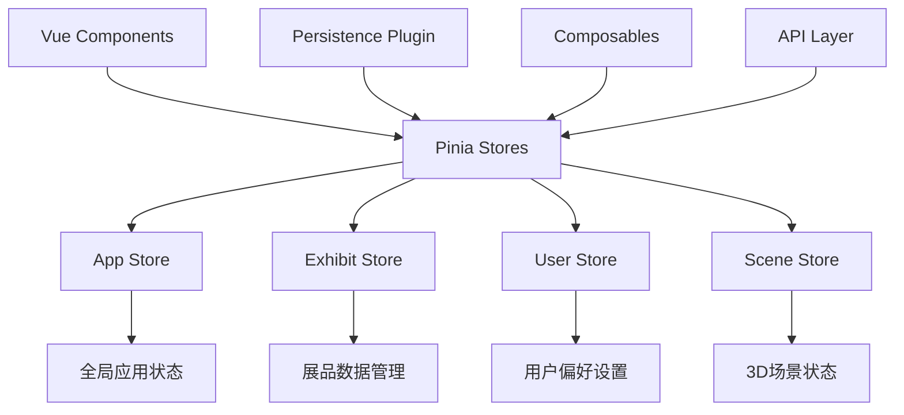

# iDesign 2025 Pinia 状态管理架构设计

## 1. 架构概述

### 1.1 当前状态管理问题分析

**现有问题：**
- 各组件间状态孤立，缺乏全局状态共享
- 展品数据在多个组件中重复获取和存储
- 3D场景状态分散在各个组件中，难以统一管理
- 用户偏好设置无法持久化和跨组件共享
- 加载状态分散，用户体验不一致

**解决方案：**
采用 Pinia 作为全局状态管理工具，设计模块化的 store 架构，实现状态的统一管理、持久化和性能优化。

### 1.2 整体架构设计



## 2. Store 模块设计

### 2.1 App Store - 全局应用状态

**职责：** 管理应用级别的全局状态，如加载状态、错误处理、路由状态等。

```javascript
// stores/app.js
import { defineStore } from 'pinia'

export const useAppStore = defineStore('app', {
  state: () => ({
    // 全局加载状态
    globalLoading: false,
    loadingMessage: '',
    
    // 全局错误状态
    globalError: null,
    errorHistory: [],
    
    // 应用配置
    appConfig: {
      theme: 'light',
      language: 'zh',
      debugMode: false
    },
    
    // 网络状态
    isOnline: navigator.onLine,
    
    // 设备信息
    deviceInfo: {
      isMobile: false,
      isTablet: false,
      performanceLevel: 'high', // low, medium, high
      supportWebGL: true
    },
    
    // 当前页面状态
    currentRoute: null,
    pageVisibility: 'visible'
  }),

  getters: {
    // 是否显示全局加载
    shouldShowGlobalLoading: (state) => state.globalLoading,
    
    // 当前主题配置
    currentTheme: (state) => state.appConfig.theme,
    
    // 是否为移动端
    isMobileDevice: (state) => state.deviceInfo.isMobile,
    
    // 设备性能等级
    devicePerformance: (state) => state.deviceInfo.performanceLevel,
    
    // 是否有网络连接
    hasNetworkConnection: (state) => state.isOnline
  },

  actions: {
    // 设置全局加载状态
    setGlobalLoading(loading, message = '') {
      this.globalLoading = loading
      this.loadingMessage = message
    },
    
    // 设置全局错误
    setGlobalError(error) {
      this.globalError = error
      if (error) {
        this.errorHistory.push({
          error,
          timestamp: Date.now(),
          route: this.currentRoute
        })
        
        // 限制错误历史记录数量
        if (this.errorHistory.length > 10) {
          this.errorHistory.shift()
        }
      }
    },
    
    // 清除全局错误
    clearGlobalError() {
      this.globalError = null
    },
    
    // 更新应用配置
    updateAppConfig(config) {
      this.appConfig = { ...this.appConfig, ...config }
    },
    
    // 设置网络状态
    setNetworkStatus(isOnline) {
      this.isOnline = isOnline
    },
    
    // 初始化设备信息
    initDeviceInfo() {
      const width = window.innerWidth
      this.deviceInfo.isMobile = width <= 768
      this.deviceInfo.isTablet = width > 768 && width <= 1024
      
      // 检测WebGL支持
      const canvas = document.createElement('canvas')
      const gl = canvas.getContext('webgl') || canvas.getContext('experimental-webgl')
      this.deviceInfo.supportWebGL = !!gl
      
      // 检测设备性能等级
      this.detectPerformanceLevel()
    },
    
    // 检测设备性能等级
    detectPerformanceLevel() {
      const canvas = document.createElement('canvas')
      const gl = canvas.getContext('webgl')
      
      if (!gl) {
        this.deviceInfo.performanceLevel = 'low'
        return
      }
      
      const renderer = gl.getParameter(gl.RENDERER)
      const vendor = gl.getParameter(gl.VENDOR)
      
      // 根据GPU信息判断性能等级
      if (renderer.includes('Adreno') || renderer.includes('Mali')) {
        this.deviceInfo.performanceLevel = 'medium'
      } else if (renderer.includes('GeForce') || renderer.includes('Radeon')) {
        this.deviceInfo.performanceLevel = 'high'
      } else {
        this.deviceInfo.performanceLevel = 'medium'
      }
    },
    
    // 设置当前路由
    setCurrentRoute(route) {
      this.currentRoute = route
    },
    
    // 设置页面可见性
    setPageVisibility(visibility) {
      this.pageVisibility = visibility
    }
  }
})
```

### 2.2 Exhibit Store - 展品数据管理

**职责：** 管理所有展品相关的数据，包括展品列表、详情、分类等。

```javascript
// stores/exhibit.js
import { defineStore } from 'pinia'
import { fetchExhibitsByCategoryId, fetchExhibitDetail } from '@/api/exhibit'
import { handleError } from '@/utils/errorHandler'

export const useExhibitStore = defineStore('exhibit', {
  state: () => ({
    // 展品数据
    exhibitsByCategory: new Map(), // categoryId -> exhibits[]
    exhibitDetails: new Map(),     // exhibitId -> exhibitDetail
    
    // 加载状态
    loadingStates: new Map(),      // categoryId -> boolean
    detailLoadingStates: new Map(), // exhibitId -> boolean
    
    // 错误状态
    errors: new Map(),             // categoryId -> error
    detailErrors: new Map(),       // exhibitId -> error
    
    // 缓存配置
    cacheConfig: {
      maxCacheSize: 50,
      cacheTimeout: 30 * 60 * 1000, // 30分钟
    },
    
    // 当前选中的展品
    currentExhibitId: null,
    currentCategoryId: null,
    
    // 搜索和过滤
    searchQuery: '',
    filterOptions: {
      category: null,
      author: null,
      year: null
    }
  }),

  getters: {
    // 获取指定分类的展品列表
    getExhibitsByCategory: (state) => (categoryId) => {
      return state.exhibitsByCategory.get(categoryId) || []
    },
    
    // 获取展品详情
    getExhibitDetail: (state) => (exhibitId) => {
      return state.exhibitDetails.get(exhibitId)
    },
    
    // 获取当前展品
    currentExhibit: (state) => {
      if (!state.currentExhibitId) return null
      return state.exhibitDetails.get(state.currentExhibitId)
    },
    
    // 获取当前分类的展品列表
    currentCategoryExhibits: (state) => {
      if (!state.currentCategoryId) return []
      return state.exhibitsByCategory.get(state.currentCategoryId) || []
    },
    
    // 检查是否正在加载
    isLoadingCategory: (state) => (categoryId) => {
      return state.loadingStates.get(categoryId) || false
    },
    
    // 检查详情是否正在加载
    isLoadingDetail: (state) => (exhibitId) => {
      return state.detailLoadingStates.get(exhibitId) || false
    },
    
    // 获取错误信息
    getCategoryError: (state) => (categoryId) => {
      return state.errors.get(categoryId)
    },
    
    // 搜索结果
    searchResults: (state) => {
      if (!state.searchQuery) return []
      
      const allExhibits = []
      for (const exhibits of state.exhibitsByCategory.values()) {
        allExhibits.push(...exhibits)
      }
      
      return allExhibits.filter(exhibit => 
        exhibit.title?.toLowerCase().includes(state.searchQuery.toLowerCase()) ||
        exhibit.author?.toLowerCase().includes(state.searchQuery.toLowerCase()) ||
        exhibit.description?.toLowerCase().includes(state.searchQuery.toLowerCase())
      )
    },
    
    // 过滤后的展品
    filteredExhibits: (state) => {
      const exhibits = state.currentCategoryId 
        ? state.exhibitsByCategory.get(state.currentCategoryId) || []
        : []
      
      return exhibits.filter(exhibit => {
        if (state.filterOptions.author && exhibit.author !== state.filterOptions.author) {
          return false
        }
        if (state.filterOptions.year && exhibit.year !== state.filterOptions.year) {
          return false
        }
        return true
      })
    }
  },

  actions: {
    // 获取展品列表
    async fetchExhibits(categoryId, forceRefresh = false) {
      // 检查缓存
      if (!forceRefresh && this.exhibitsByCategory.has(categoryId)) {
        return this.exhibitsByCategory.get(categoryId)
      }
      
      this.loadingStates.set(categoryId, true)
      this.errors.delete(categoryId)
      
      try {
        const response = await fetchExhibitsByCategoryId(categoryId)
        const exhibits = response.data?.data || []
        
        this.exhibitsByCategory.set(categoryId, exhibits)
        this.manageCacheSize()
        
        return exhibits
      } catch (error) {
        const handledError = handleError(error, 'fetchExhibits')
        this.errors.set(categoryId, handledError.message)
        throw error
      } finally {
        this.loadingStates.set(categoryId, false)
      }
    },
    
    // 获取展品详情
    async fetchExhibitDetail(exhibitId, forceRefresh = false) {
      // 检查缓存
      if (!forceRefresh && this.exhibitDetails.has(exhibitId)) {
        return this.exhibitDetails.get(exhibitId)
      }
      
      this.detailLoadingStates.set(exhibitId, true)
      this.detailErrors.delete(exhibitId)
      
      try {
        const response = await fetchExhibitDetail(exhibitId)
        const detail = response.data?.data
        
        if (detail) {
          this.exhibitDetails.set(exhibitId, detail)
          this.manageCacheSize()
        }
        
        return detail
      } catch (error) {
        const handledError = handleError(error, 'fetchExhibitDetail')
        this.detailErrors.set(exhibitId, handledError.message)
        throw error
      } finally {
        this.detailLoadingStates.set(exhibitId, false)
      }
    },
    
    // 设置当前展品
    setCurrentExhibit(exhibitId) {
      this.currentExhibitId = exhibitId
    },
    
    // 设置当前分类
    setCurrentCategory(categoryId) {
      this.currentCategoryId = categoryId
    },
    
    // 搜索展品
    searchExhibits(query) {
      this.searchQuery = query
    },
    
    // 设置过滤选项
    setFilterOptions(options) {
      this.filterOptions = { ...this.filterOptions, ...options }
    },
    
    // 清除过滤
    clearFilters() {
      this.filterOptions = {
        category: null,
        author: null,
        year: null
      }
      this.searchQuery = ''
    },
    
    // 管理缓存大小
    manageCacheSize() {
      // 清理过期缓存
      const now = Date.now()
      
      // 简化的缓存管理，实际项目中可以更复杂
      if (this.exhibitsByCategory.size > this.cacheConfig.maxCacheSize) {
        const firstKey = this.exhibitsByCategory.keys().next().value
        this.exhibitsByCategory.delete(firstKey)
      }
      
      if (this.exhibitDetails.size > this.cacheConfig.maxCacheSize) {
        const firstKey = this.exhibitDetails.keys().next().value
        this.exhibitDetails.delete(firstKey)
      }
    },
    
    // 清除所有缓存
    clearCache() {
      this.exhibitsByCategory.clear()
      this.exhibitDetails.clear()
      this.loadingStates.clear()
      this.detailLoadingStates.clear()
      this.errors.clear()
      this.detailErrors.clear()
    },
    
    // 预加载相关展品
    async preloadRelatedExhibits(exhibitId) {
      const exhibit = this.exhibitDetails.get(exhibitId)
      if (!exhibit) return
      
      // 预加载同一作者的其他作品
      if (exhibit.author) {
        const categoryExhibits = this.currentCategoryExhibits
        const relatedExhibits = categoryExhibits.filter(e => 
          e.author === exhibit.author && e.id !== exhibitId
        )
        
        // 异步预加载前3个相关展品的详情
        const preloadPromises = relatedExhibits
          .slice(0, 3)
          .map(e => this.fetchExhibitDetail(e.id).catch(() => {}))
        
        Promise.all(preloadPromises)
      }
    }
  }
})
```

### 2.3 User Store - 用户偏好设置

**职责：** 管理用户的个人偏好设置、浏览历史、收藏等。

```javascript
// stores/user.js
import { defineStore } from 'pinia'

export const useUserStore = defineStore('user', {
  state: () => ({
    // 用户偏好设置
    preferences: {
      language: 'zh',
      theme: 'light',
      autoPlay: true,
      soundEnabled: true,
      animationEnabled: true,
      highQualityMode: true,
      
      // 3D场景偏好
      cameraSpeed: 1.0,
      mouseSensitivity: 1.0,
      keyboardControls: {
        moveForward: 'KeyW',
        moveBackward: 'KeyS',
        moveLeft: 'KeyA',
        moveRight: 'KeyD'
      }
    },
    
    // 浏览历史
    viewHistory: [], // { exhibitId, timestamp, duration }
    
    // 收藏列表
    favorites: [], // exhibitId[]
    
    // 用户统计
    statistics: {
      totalViewTime: 0,
      exhibitsViewed: 0,
      hallsVisited: 0,
      lastVisit: null
    },
    
    // 会话信息
    sessionInfo: {
      sessionId: null,
      startTime: null,
      currentHall: null,
      currentExhibit: null
    }
  }),

  getters: {
    // 是否收藏了指定展品
    isFavorite: (state) => (exhibitId) => {
      return state.favorites.includes(exhibitId)
    },
    
    // 获取最近浏览的展品
    recentlyViewed: (state) => {
      return state.viewHistory
        .sort((a, b) => b.timestamp - a.timestamp)
        .slice(0, 10)
    },
    
    // 获取浏览时长最长的展品
    mostViewedExhibits: (state) => {
      const exhibitDurations = new Map()
      
      state.viewHistory.forEach(record => {
        const current = exhibitDurations.get(record.exhibitId) || 0
        exhibitDurations.set(record.exhibitId, current + record.duration)
      })
      
      return Array.from(exhibitDurations.entries())
        .sort((a, b) => b[1] - a[1])
        .slice(0, 5)
        .map(([exhibitId, duration]) => ({ exhibitId, duration }))
    },
    
    // 当前会话时长
    currentSessionDuration: (state) => {
      if (!state.sessionInfo.startTime) return 0
      return Date.now() - state.sessionInfo.startTime
    }
  },

  actions: {
    // 更新用户偏好
    updatePreferences(newPreferences) {
      this.preferences = { ...this.preferences, ...newPreferences }
    },
    
    // 添加浏览记录
    addViewRecord(exhibitId, duration = 0) {
      const record = {
        exhibitId,
        timestamp: Date.now(),
        duration
      }
      
      this.viewHistory.push(record)
      
      // 限制历史记录数量
      if (this.viewHistory.length > 100) {
        this.viewHistory.shift()
      }
      
      // 更新统计信息
      this.statistics.exhibitsViewed++
      this.statistics.totalViewTime += duration
      this.statistics.lastVisit = Date.now()
    },
    
    // 切换收藏状态
    toggleFavorite(exhibitId) {
      const index = this.favorites.indexOf(exhibitId)
      if (index > -1) {
        this.favorites.splice(index, 1)
      } else {
        this.favorites.push(exhibitId)
      }
    },
    
    // 添加到收藏
    addToFavorites(exhibitId) {
      if (!this.favorites.includes(exhibitId)) {
        this.favorites.push(exhibitId)
      }
    },
    
    // 从收藏中移除
    removeFromFavorites(exhibitId) {
      const index = this.favorites.indexOf(exhibitId)
      if (index > -1) {
        this.favorites.splice(index, 1)
      }
    },
    
    // 清除浏览历史
    clearViewHistory() {
      this.viewHistory = []
    },
    
    // 初始化会话
    initSession() {
      this.sessionInfo.sessionId = `session_${Date.now()}_${Math.random().toString(36).substr(2, 9)}`
      this.sessionInfo.startTime = Date.now()
    },
    
    // 设置当前位置
    setCurrentLocation(hall, exhibit = null) {
      this.sessionInfo.currentHall = hall
      this.sessionInfo.currentExhibit = exhibit
      
      if (hall) {
        this.statistics.hallsVisited++
      }
    },
    
    // 结束会话
    endSession() {
      if (this.sessionInfo.startTime) {
        const sessionDuration = Date.now() - this.sessionInfo.startTime
        this.statistics.totalViewTime += sessionDuration
      }
      
      this.sessionInfo = {
        sessionId: null,
        startTime: null,
        currentHall: null,
        currentExhibit: null
      }
    },
    
    // 重置所有数据
    resetUserData() {
      this.viewHistory = []
      this.favorites = []
      this.statistics = {
        totalViewTime: 0,
        exhibitsViewed: 0,
        hallsVisited: 0,
        lastVisit: null
      }
    }
  }
})
```

### 2.4 Scene Store - 3D场景状态管理

**职责：** 管理3D场景的状态，包括相机位置、模型加载状态、渲染配置等。

```javascript
// stores/scene.js
import { defineStore } from 'pinia'

export const useSceneStore = defineStore('scene', {
  state: () => ({
    // 当前场景信息
    currentScene: {
      hallId: null,
      modelPath: null,
      isLoaded: false,
      loadingProgress: 0
    },
    
    // 相机状态
    camera: {
      position: { x: 0, y: 0, z: 0 },
      rotation: { x: 0, y: 0, z: 0 },
      target: { x: 0, y: 0, z: 0 },
      fov: 75,
      near: 0.1,
      far: 1000
    },
    
    // 渲染配置
    renderConfig: {
      quality: 'high', // low, medium, high
      shadows: true,
      antialiasing: true,
      postProcessing: true,
      maxFPS: 60,
      adaptiveQuality: true
    },
    
    // 模型缓存状态
    modelCache: {
      cached: new Map(), // modelPath -> cacheInfo
      loading: new Set(), // 正在加载的模型路径
      failed: new Set()   // 加载失败的模型路径
    },
    
    // 交互状态
    interaction: {
      isMouseDown: false,
      isDragging: false,
      hoveredObject: null,
      selectedObject: null,
      raycastEnabled: true
    },
    
    // 性能监控
    performance: {
      fps: 0,
      frameTime: 0,
      drawCalls: 0,
      triangles: 0,
      memoryUsage: 0,
      lastUpdate: 0
    },
    
    // 场景对象
    sceneObjects: new Map(), // objectId -> objectInfo
    
    // 光照设置
    lighting: {
      ambientIntensity: 0.8,
      directionalIntensity: 1.0,
      shadowsEnabled: true,
      shadowQuality: 'high'
    }
  }),

  getters: {
    // 是否正在加载场景
    isSceneLoading: (state) => {
      return !state.currentScene.isLoaded || state.currentScene.loadingProgress < 100
    },
    
    // 当前渲染质量
    currentQuality: (state) => state.renderConfig.quality,
    
    // 是否启用高质量渲染
    isHighQuality: (state) => state.renderConfig.quality === 'high',
    
    // 当前FPS
    currentFPS: (state) => state.performance.fps,
    
    // 性能等级
    performanceLevel: (state) => {
      const fps = state.performance.fps
      if (fps >= 50) return 'excellent'
      if (fps >= 30) return 'good'
      if (fps >= 20) return 'fair'
      return 'poor'
    },
    
    // 是否需要降低质量
    shouldReduceQuality: (state) => {
      return state.renderConfig.adaptiveQuality && 
             state.performance.fps < 30 && 
             state.renderConfig.quality !== 'low'
    },
    
    // 缓存统计
    cacheStats: (state) => ({
      cached: state.modelCache.cached.size,
      loading: state.modelCache.loading.size,
      failed: state.modelCache.failed.size
    })
  },

  actions: {
    // 设置当前场景
    setCurrentScene(hallId, modelPath) {
      this.currentScene.hallId = hallId
      this.currentScene.modelPath = modelPath
      this.currentScene.isLoaded = false
      this.currentScene.loadingProgress = 0
    },
    
    // 更新加载进度
    updateLoadingProgress(progress) {
      this.currentScene.loadingProgress = Math.min(100, Math.max(0, progress))
      if (progress >= 100) {
        this.currentScene.isLoaded = true
      }
    },
    
    // 设置场景加载完成
    setSceneLoaded() {
      this.currentScene.isLoaded = true
      this.currentScene.loadingProgress = 100
    },
    
    // 更新相机状态
    updateCamera(cameraState) {
      this.camera = { ...this.camera, ...cameraState }
    },
    
    // 保存相机位置
    saveCameraPosition(position, rotation, target) {
      this.camera.position = { ...position }
      this.camera.rotation = { ...rotation }
      this.camera.target = { ...target }
    },
    
    // 恢复相机位置
    restoreCameraPosition() {
      return {
        position: { ...this.camera.position },
        rotation: { ...this.camera.rotation },
        target: { ...this.camera.target }
      }
    },
    
    // 更新渲染配置
    updateRenderConfig(config) {
      this.renderConfig = { ...this.renderConfig, ...config }
    },
    
    // 自适应质量调整
    adaptiveQualityAdjust() {
      if (!this.renderConfig.adaptiveQuality) return
      
      const fps = this.performance.fps
      
      if (fps < 25 && this.renderConfig.quality !== 'low') {
        // 降低质量
        const qualityLevels = ['high', 'medium', 'low']
        const currentIndex = qualityLevels.indexOf(this.renderConfig.quality)
        if (currentIndex < qualityLevels.length - 1) {
          this.renderConfig.quality = qualityLevels[currentIndex + 1]
          console.log(`自动降低渲染质量到: ${this.renderConfig.quality}`)
        }
      } else if (fps > 50 && this.renderConfig.quality !== 'high') {
        // 提高质量
        const qualityLevels = ['low', 'medium', 'high']
        const currentIndex = qualityLevels.indexOf(this.renderConfig.quality)
        if (currentIndex < qualityLevels.length - 1) {
          this.renderConfig.quality = qualityLevels[currentIndex + 1]
          console.log(`自动提高渲染质量到: ${this.renderConfig.quality}`)
        }
      }
    },
    
    // 更新性能指标
    updatePerformance(metrics) {
      this.performance = { ...this.performance, ...metrics, lastUpdate: Date.now() }
      
      // 触发自适应质量调整
      this.adaptiveQualityAdjust()
    },
    
    // 设置交互状态
    setInteractionState(state) {
      this.interaction = { ...this.interaction, ...state }
    },
    
    // 设置悬停对象
    setHoveredObject(object) {
      this.interaction.hoveredObject = object
    },
    
    // 设置选中对象
    setSelectedObject(object) {
      this.interaction.selectedObject = object
    },
    
    // 添加场景对象
    addSceneObject(objectId, objectInfo) {
      this.sceneObjects.set(objectId, objectInfo)
    },
    
    // 移除场景对象
    removeSceneObject(objectId) {
      this.sceneObjects.delete(objectId)
    },
    
    // 清除所有场景对象
    clearSceneObjects() {
      this.sceneObjects.clear()
    },
    
    // 更新模型缓存状态
    setModelLoading(modelPath) {
      this.modelCache.loading.add(modelPath)
      this.modelCache.failed.delete(modelPath)
    },
    
    setModelLoaded(modelPath, cacheInfo) {
      this.modelCache.loading.delete(modelPath)
      this.modelCache.failed.delete(modelPath)
      this.modelCache.cached.set(modelPath, {
        ...cacheInfo,
        timestamp: Date.now()
      })
    },
    
    setModelFailed(modelPath) {
      this.modelCache.loading.delete(modelPath)
      this.modelCache.failed.add(modelPath)
    },
    
    // 清理模型缓存
    clearModelCache() {
      this.modelCache.cached.clear()
      this.modelCache.loading.clear()
      this.modelCache.failed.clear()
    },
    
    // 更新光照设置
    updateLighting(lightingConfig) {
      this.lighting = { ...this.lighting, ...lightingConfig }
    },
    
    // 重置场景状态
    resetScene() {
      this.currentScene = {
        hallId: null,
        modelPath: null,
        isLoaded: false,
        loadingProgress: 0
      }
      this.clearSceneObjects()
      this.setInteractionState({
        isMouseDown: false,
        isDragging: false,
        hoveredObject: null,
        selectedObject: null
      })
    }
  }
})
```

## 3. 状态持久化策略

### 3.1 持久化配置

```javascript
// stores/persistence.js
import { defineStore } from 'pinia'

// 持久化配置
export const persistenceConfig = {
  // 需要持久化的 store
  stores: {
    user: {
      // 持久化整个 store
      persist: true,
      storage: localStorage,
      key: 'idesign-user-store'
    },
    app: {
      // 只持久化部分状态
      persist: true,
      storage: localStorage,
      key: 'idesign-app-store',
      paths: ['appConfig', 'deviceInfo'] // 只持久化这些字段
    },
    exhibit: {
      // 使用 sessionStorage，会话结束后清除
      persist: true,
      storage: sessionStorage,
      key: 'idesign-exhibit-cache',
      paths: ['exhibitsByCategory', 'exhibitDetails']
    },
    scene: {
      // 只持久化相机位置和渲染配置
      persist: true,
      storage: localStorage,
      key: 'idesign-scene-config',
      paths: ['camera', 'renderConfig', 'lighting']
    }
  }
}

// 自定义持久化插件
export function createPersistencePlugin() {
  return ({ store }) => {
    const config = persistenceConfig.stores[store.$id]
    if (!config || !config.persist) return

    // 从存储中恢复状态
    const savedState = config.storage.getItem(config.key)
    if (savedState) {
      try {
        const parsedState = JSON.parse(savedState)
        
        if (config.paths) {
          // 只恢复指定的字段
          config.paths.forEach(path => {
            if (parsedState[path] !== undefined) {
              store.$patch({ [path]: parsedState[path] })
            }
          })
        } else {
          // 恢复整个状态
          store.$patch(parsedState)
        }
      } catch (error) {
        console.warn(`Failed to restore state for ${store.$id}:`, error)
      }
    }

    // 监听状态变化并保存
    store.$subscribe((mutation, state) => {
      try {
        let stateToSave = state
        
        if (config.paths) {
          // 只保存指定的字段
          stateToSave = {}
          config.paths.forEach(path => {
            stateToSave[path] = state[path]
          })
        }
        
        config.storage.setItem(config.key, JSON.stringify(stateToSave))
      } catch (error) {
        console.warn(`Failed to save state for ${store.$id}:`, error)
      }
    })
  }
}
```

## 4. 与现有 Composables 集成

### 4.1 集成策略

```javascript
// composables/useExhibitWithStore.js
import { computed } from 'vue'
import { useExhibitStore } from '@/stores/exhibit'
import { useAppStore } from '@/stores/app'

/**
 * 集成 Pinia store 的展品 composable
 * 保持与原有 useExhibit 的 API 兼容性
 */
export function useExhibitWithStore() {
  const exhibitStore = useExhibitStore()
  const appStore = useAppStore()

  // 保持原有 API 兼容性
  const exhibits = computed(() => exhibitStore.currentCategoryExhibits)
  const loading = computed(() => exhibitStore.isLoadingCategory(exhibitStore.currentCategoryId))
  const error = computed(() => exhibitStore.getCategoryError(exhibitStore.currentCategoryId))

  // 扩展功能
  const searchResults = computed(() => exhibitStore.searchResults)
  const filteredExhibits = computed(() => exhibitStore.filteredExhibits)

  async function fetchExhibits(categoryId) {
    appStore.setGlobalLoading(true, '正在加载展品...')
    try {
      exhibitStore.setCurrentCategory(categoryId)
      const result = await exhibitStore.fetchExhibits(categoryId)
      return result
    } finally {
      appStore.setGlobalLoading(false)
    }
  }

  function findExhibitById(exhibitId) {
    return exhibitStore.getExhibitDetail(exhibitId) || 
           exhibits.value.find(e => Number(e.id) === Number(exhibitId))
  }

  // 新增功能
  function searchExhibits(query) {
    exhibitStore.searchExhibits(query)
  }

  function setFilter(options) {
    exhibitStore.setFilterOptions(options)
  }

  return {
    // 原有 API
    exhibits,
    loading,
    error,
    fetchExhibits,
    findExhibitById,
    
    // 新增 API
    searchResults,
    filteredExhibits,
    searchExhibits,
    setFilter,
    
    // Store 实例（用于高级用法）
    exhibitStore
  }
}
```

### 4.2 渐进式迁移

```javascript
// composables/migration.js

/**
 * 渐进式迁移辅助函数
 * 允许组件逐步从 composables 迁移到 Pinia stores
 */
export function createMigrationWrapper(originalComposable, storeComposable) {
  return function(options = {}) {
    const useStore = options.useStore !== false // 默认使用 store
    
    if (useStore) {
      return storeComposable()
    } else {
      return originalComposable()
    }
  }
}

// 使用示例
import { useExhibit } from '@/composables/useExhibit'
import { useExhibitWithStore } from '@/composables/useExhibitWithStore'

export const useExhibitMigration = createMigrationWrapper(
  useExhibit,
  useExhibitWithStore
)
```

## 5. 性能优化考虑

### 5.1 Store 性能优化

```javascript
// stores/optimizations.js

/**
 * Store 性能优化插件
 */
export function createPerformancePlugin() {
  return ({ store }) => {
    // 防抖更新
    let updateTimer = null
    const debouncedUpdate = (callback) => {
      if (updateTimer) clearTimeout(updateTimer)
      updateTimer = setTimeout(callback, 16) // 约60fps
    }

    // 批量更新
    let batchUpdates = []
    const flushBatchUpdates = () => {
      if (batchUpdates.length > 0) {
        store.$patch((state) => {
          batchUpdates.forEach(update => update(state))
        })
        batchUpdates = []
      }
    }

    store.batchUpdate = (updateFn) => {
      batchUpdates.push(updateFn)
      debouncedUpdate(flushBatchUpdates)
    }

    // 性能监控
    if (import.meta.env.DEV) {
      store.$subscribe((mutation, state) => {
        const start = performance.now()
        // 监控状态更新性能
        requestAnimationFrame(() => {
          const end = performance.now()
          if (end - start > 16) {
            console.warn(`Store ${store.$id} update took ${end - start}ms`)
          }
        })
      })
    }
  }
}
```

### 5.2 内存管理

```javascript
// stores/memoryManagement.js

/**
 * 内存管理插件
 */
export function createMemoryManagementPlugin() {
  return ({ store }) => {
    // 定期清理过期缓存
    const cleanupInterval = setInterval(() => {
      if (store.manageCacheSize) {
        store.manageCacheSize()
      }
    }, 5 * 60 * 1000) // 每5分钟清理一次

    // 页面隐藏时清理
    document.addEventListener('visibilitychange', () => {
      if (document.hidden && store.clearCache) {
        store.clearCache()
      }
    })

    // 内存压力监控
    if ('memory' in performance) {
      const checkMemoryPressure = () => {
        const memInfo = performance.memory
        const usedRatio = memInfo.usedJSHeapSize / memInfo.jsHeapSizeLimit
        
        if (usedRatio > 0.8) {
          console.warn('Memory pressure detected, clearing caches')
          if (store.clearCache) {
            store.clearCache()
          }
        }
      }

      setInterval(checkMemoryPressure, 30000) // 每30秒检查一次
    }

    // 清理定时器
    store.$dispose = () => {
      clearInterval(cleanupInterval)
    }
  }
}
```

## 6. 使用示例

### 6.1 在组件中使用

```vue
<!-- Hall.vue -->
<template>
  <div class="hall-container">
    <div v-if="appStore.globalLoading" class="loading">
      {{ appStore.loadingMessage }}
    </div>
    
    <div v-if="sceneStore.isSceneLoading" class="scene-loading">
      加载进度: {{ sceneStore.currentScene.loadingProgress }}%
    </div>
    
    <canvas ref="canvasRef" @click="handleCanvasClick" />
    
    <div class="performance-info" v-if="appStore.appConfig.debugMode">
      FPS: {{ sceneStore.currentFPS }}
      质量: {{ sceneStore.currentQuality }}
    </div>
  </div>
</template>

<script setup>
import { ref, onMounted, onUnmounted, watch } from 'vue'
import { useRoute } from 'vue-router'
import { useAppStore } from '@/stores/app'
import { useSceneStore } from '@/stores/scene'
import { useUserStore } from '@/stores/user'

const route = useRoute()
const appStore = useAppStore()
const sceneStore = useSceneStore()
const userStore = useUserStore()

const canvasRef = ref()

// 监听路由变化
watch(() => route.params.hallId, async (newHallId) => {
  if (newHallId) {
    await loadHall(newHallId)
  }
})

async function loadHall(hallId) {
  appStore.setGlobalLoading(true, '正在加载展厅...')
  sceneStore.setCurrentScene(hallId, `/models/hall-${hallId}.glb`)
  
  try {
    // 加载3D场景逻辑
    await loadSceneModel(hallId)
    
    // 记录用户访问
    userStore.setCurrentLocation(hallId)
    
  } catch (error) {
    appStore.setGlobalError(error)
  } finally {
    appStore.setGlobalLoading(false)
  }
}

function handleCanvasClick(event) {
  // 处理3D场景交互
  const intersectedObject = performRaycast(event)
  if (intersectedObject) {
    sceneStore.setSelectedObject(intersectedObject)
  }
}

onMounted(() => {
  // 初始化应用
  appStore.initDeviceInfo()
  userStore.initSession()
  
  // 恢复相机位置
  const savedCamera = sceneStore.restoreCameraPosition()
  // 应用到3D相机...
})

onUnmounted(() => {
  // 保存当前状态
  sceneStore.saveCameraPosition(/* 当前相机状态 */)
  userStore.endSession()
})
</script>
```

### 6.2 在 Information.vue 中使用

```vue
<!-- Information.vue -->
<template>
  <div class="information-container">
    <div v-if="exhibitStore.isLoadingDetail(currentExhibitId)" class="loading">
      正在加载展品详情...
    </div>
    
    <div v-else-if="currentExhibit" class="exhibit-detail">
      <h1>{{ currentExhibit.title }}</h1>
      <p>{{ currentExhibit.description }}</p>
      
      <button @click="toggleFavorite" :class="{ active: isFavorite }">
        {{ isFavorite ? '取消收藏' : '收藏' }}
      </button>
    </div>
    
    <div class="related-exhibits">
      <h3>相关展品</h3>
      <div v-for="exhibit in filteredExhibits" :key="exhibit.id">
        {{ exhibit.title }}
      </div>
    </div>
  </div>
</template>

<script setup>
import { computed, onMounted, watch } from 'vue'
import { useRoute } from 'vue-router'
import { useExhibitStore } from '@/stores/exhibit'
import { useUserStore } from '@/stores/user'

const route = useRoute()
const exhibitStore = useExhibitStore()
const userStore = useUserStore()

const currentExhibitId = computed(() => route.params.exhibitId)
const currentExhibit = computed(() => exhibitStore.currentExhibit)
const filteredExhibits = computed(() => exhibitStore.filteredExhibits)
const isFavorite = computed(() => userStore.isFavorite(currentExhibitId.value))

// 监听展品ID变化
watch(currentExhibitId, async (newId) => {
  if (newId) {
    exhibitStore.setCurrentExhibit(newId)
    await exhibitStore.fetchExhibitDetail(newId)
    
    // 预加载相关展品
    exhibitStore.preloadRelatedExhibits(newId)
    
    // 记录浏览历史
    userStore.addViewRecord(newId)
  }
})

function toggleFavorite() {
  userStore.toggleFavorite(currentExhibitId.value)
}

onMounted(async () => {
  const categoryId = route.params.categoryId
  if (categoryId) {
    await exhibitStore.fetchExhibits(categoryId)
  }
})
</script>
```

## 7. 总结

这个 Pinia 状态管理架构为 iDesign 2025 项目提供了：

### 7.1 核心优势

1. **模块化设计**: 四个专门的 store 分别管理不同领域的状态
2. **性能优化**: 缓存机制、自适应质量调整、内存管理
3. **持久化支持**: 灵活的状态持久化策略
4. **向后兼容**: 与现有 composables 平滑集成
5. **开发体验**: 完善的 TypeScript 支持和调试工具

### 7.2 实施建议

1. **渐进式迁移**: 先在新功能中使用 Pinia，逐步迁移现有代码
2. **性能监控**: 在开发环境中启用性能监控插件
3. **测试覆盖**: 为每个 store 编写单元测试
4. **文档维护**: 保持 store API 文档的及时更新

### 7.3 扩展性

这个架构设计具有良好的扩展性，可以轻松添加新的 store 模块，如：
- **Analytics Store**: 用户行为分析
- **Notification Store**: 消息通知管理
- **Cache Store**: 统一缓存管理
- **WebRTC Store**: 实时通信功能

通过这个完整的状态管理架构，你的项目将具备更好的可维护性、性能和用户体验。